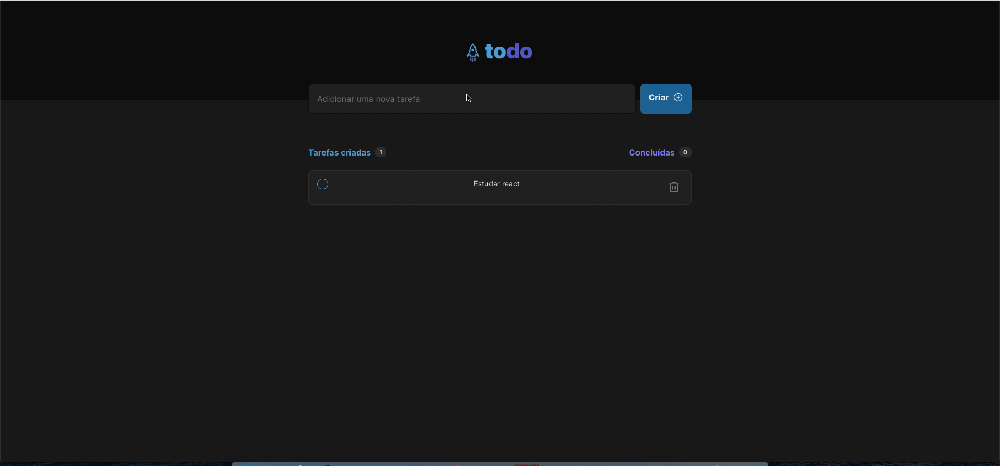

## 💻 Projeto

Esse projeto foi desenvolvido para o desafio do curso ignite da Rocketseat. Este projeto é um to do list, onde você pode criar tarefas, marcar como concluídas e deletar.

## Iniciando o projeto

Instale as dependências com npm ou yarn.

Execute o projeto com npm run dev ou yarn dev.

## 🚀 Tecnologias

Esse projeto foi desenvolvido com as seguintes tecnologias:

- Vite
- React Js
- Typescript

## Preview

